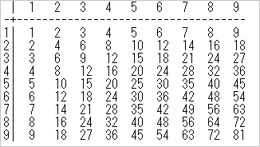

# Ex01_2

### 概要
九九の表を標準出力に出力します。

### 技術要素
* 標準出力
* 算術演算子
* 制御構造
* 変数

### リファレンス
* Schoo
  * Java入門 Javaの概要と歴史
  * Java入門 開発環境 eclipseの操作
  * Java入門 Javaの基本構文

### Git
* 作業ブランチ
  * develop/Ex01_2
* MergeRequestタイトル
  * Ex01_2

---
## 課題
九九の表を以下の出力例の形式で表示しなさい。Eclipseのコンソール上で表示が揃っていればOKです。

#### 出力例


#### ヒント1
水平方向の罫線(-と+で作る)は、表全体の出力を見ながら、決め打ちで出力してOKです。つまり、水平方向の罫線の数を計算して出力する必要はありません。

#### ヒント2
数字を横方向に揃えるにはタブを出力すると揃います。タブは文字列出力の際に制御文字「\t」を出力すればよいです。

##### 例
```java
System.out.print("\t");
```

#### 作成するクラスのFQCN

* `jp.co.axrossroad.sup.ex0102.MultiplicationTable`
