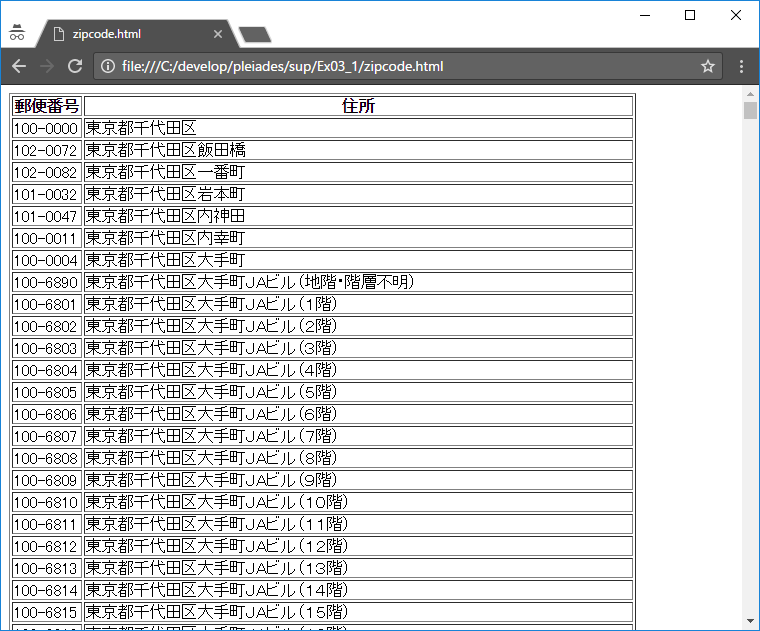

# Ex03_1

### 概要
テキストファイルの読み込み、書き込みを行います。

### 技術要素
* ファイル入出力
* 例外処理

### リファレンス
* 『スッキリわかるJava入門 第2版』
  * P.561～P.600

* 『スッキリわかるJava入門 実践編 第2版』
  * P.247～P.284

### Git
* 作業ブランチ
  * develop/Ex03_1
* MergeRequestタイトル
  * Ex03_1

---

## 課題
郵便番号CSVファイルを読み込み、HTMLに整形したファイルを出力してください。


日本郵便株式会社は、全国の郵便番号のデータをCSVファイルの形式で公開しており、自由に使用することを認めています。このCSVファイルを入力として、整形したファイルを出力します。今回使用するCSVファイルは東京都のデータです。

#### 入力ファイル(CSVファイル)
```
13TOKYO.csv
```

プロジェクト直下のdataディレクトリの中にあります。

ファイルの中のデータフォーマットは日本郵便株式会社のサイトで説明されています。以下のサイトの「留意点」の中の「郵便番号データファイルの形式等」と「データの格納イメージ」の箇所をよく読んでください。

http://www.post.japanpost.jp/zipcode/dl/readme.html

##### 注意
13TOKYO.csvは文字コードが「__Shift_JIS__」です。
Javaは標準では文字コード「__UTF-8__」で扱うため、
文字コード「Shift_JIS」を指定してファイルの内容を読み込む必要があります。

文字コードを指定してファイルを読み込む場合は「`InputStreamReader`」を使うと良いでしょう。
```java
BufferedReader buffReader = null;

buffReader = new BufferedReader(new InputStreamReader(new FileInputStream("data/13TOKYO.CSV"), "Shift_JIS"));
```

#### 出力ファイル(HTMLファイル)
出力ファイルの文字コードは、デフォルトのUTF-8で構いません。
出力ファイルの名称は「`zipcode.html`」です。「out」ディレクトリの中に出力してください。→パスの指定は「`out/zipcode.html`」
zipcode.htmlをWebブラウザで開くと、以下のようなHTMLのテーブルで表示されます。
テーブルの第1列は「郵便番号」、第2列は「住所」です。




#### 条件1
13TOKYO.CSVファイルは読み込みのみに使用し、ユーザが勝手に編集してはいけません。
13TOKYO.CSVは、住所の変更などに伴って日本郵便株式会社から最新のCSVファイルが提供されるため、
その都度ファイルの内容に手を加えるのは手間であり、不具合の元だからです。

#### 条件2
「郵便番号」は7桁で、先頭から3桁と4桁目の間にハイフン「-」を入れてください。
「住所」は、CSVファイルの7～9項目目（「都道府県」「市区」「町、建物」）を連結して出力してください。
なお、以下の文字列は削除してから出力してください。第9項目目に出現する場合があります。
* 以下に掲載がない場合
* （次のビルを除く）

#### 条件3
ファイルのclose漏れに注意してください。今回は入力用、出力用の2つのファイルを扱っていますので、
いずれのclose処理も確実に実行されるようにしてください。
try-with-resources構文を用いてもOKです。

#### ヒント
文字列に関する処理が多く出てきます(文字列分割、文字列置換など)。
Java API仕様のStringクラスの記述を読みつつ、インターネットで方法を検索してください。

#### 作成するクラスのFQCN

* `jp.co.axrossroad.sup.ex0301.ZipCodeFilter`
