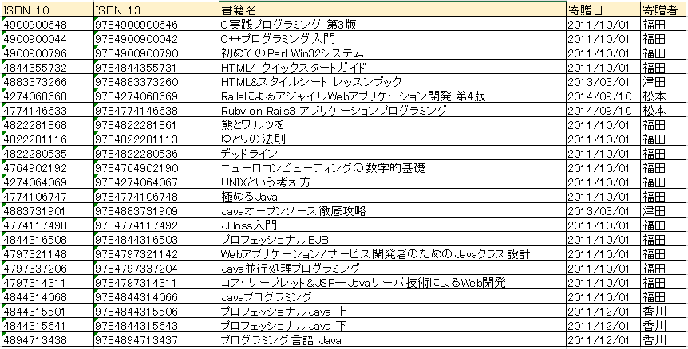

# Ex04_2

### 概要
ループ内でのBeanの作成を学びます。

### 技術要素
* カプセル化
* クラス
* 継承
* コンストラクタ
* オーバーライド
* オーバーロード

### リファレンス
* 『スッキリわかるJava入門 第2版』
  * P.269～P.442

### Git
* 作業ブランチ
  * develop/Ex04_2
* MergeRequestタイトル
  * Ex04_2

---

## 課題

社内の本棚に置いてある書籍は書籍管理情報として管理されています。
一例を挙げると、以下のような情報を管理しています。



この書籍情報1冊分の情報を格納するための、書籍Beanを作成しなさい。
書籍Beanはカプセル化の概念を意識して作成してください。

書籍Beanを作成したら、上の書籍情報をCSVにしたbooks.csvファイルから書籍情報を読み込み、
書籍Beanのインスタンスに格納しなさい(books.csvは、Ex04_2のdataディレクトリにあります)。

書籍Beanは書籍1冊ごとに情報を持つため、まとめて管理するための配列を用意してください[^注1]。
配列の要素数は、余裕を持ったものを用意しておけばよいです。

配列に格納後は、寄贈日と書籍名の一覧を寄贈日の昇順(古い→新しい)で、以下の出力例のように、標準出力に出力してください。
なお寄贈日が同一の日付である書籍情報の出力順序は問いません。

#### 出力例
```
2011/10/01:C実践プログラミング 第3版
2011/10/01:C++プログラミング入門
2011/10/01:初めてのPerl Win32システム
2011/10/01:HTML4 クイックスタートガイド
2011/10/01:熊とワルツを
2011/10/01:ゆとりの法則
2011/10/01:デッドライン
2011/10/01:ニューロコンピューティングの数学的基礎
2011/10/01:UNIXという考え方
2011/10/01:極めるJava
2011/10/01:JBoss入門
2011/10/01:プロフェッショナルEJB
2011/10/01:Webアプリケーション/サービス開発者のためのJavaクラス設計
2011/10/01:Java並行処理プログラミング
2011/10/01:コア・サーブレット&JSP―Javaサーバ技術によるWeb開発
2011/10/01:Javaプログラミング
2011/12/01:プロフェッショナルJava 上
2011/12/01:プロフェッショナルJava 下
2011/12/01:プログラミング言語 Java
2013/03/01:HTML&スタイルシート レッスンブック
2013/03/01:Javaオープンソース徹底攻略
2014/09/10:RailsによるアジャイルWebアプリケーション開発 第4版
2014/09/10:Ruby on Rails3 アプリケーションプログラミング
```


### 条件1
ISBNコード(国際標準図書番号)は、数値ではなく文字列として書籍Beanの中に格納する。

### 条件2
寄贈日は日付型ではなく、文字列として書籍Beanの中に格納する。

### ヒント1
配列の並び替えは`Arrays.sort(並び替え対象の配列, 比較用クラスのインスタンス)`を使用する。以下のコードを使用してよいです。

```java
Arrays.sort(bookArray, new Comparator<BookBean>() {
    @Override
    public int compare(BookBean book1, BookBean book2) {
        // 日付比較は、文字列の辞書式比較を使用
        return book1.getDonationDate().compareTo(book2.getDonationDate());
    }
});
```


#### 作成するクラスのFQCN

* アプリケーションエントリポイント
  * `jp.co.axrossroad.sup.ex0402.BookDataReader`
* ファイル読み込み (Ex04_1を参考に)
  * `jp.co.axrossroad.sup.ex0402.FileAccess`
* 書籍Bean
  * `jp.co.axrossroad.sup.ex0402.bean.BookBean`


[^注1]: 本来はまとめるために、可変要素のリストを使いますが、リストの使い方は後の課題で行いますので、ここでは配列とします。