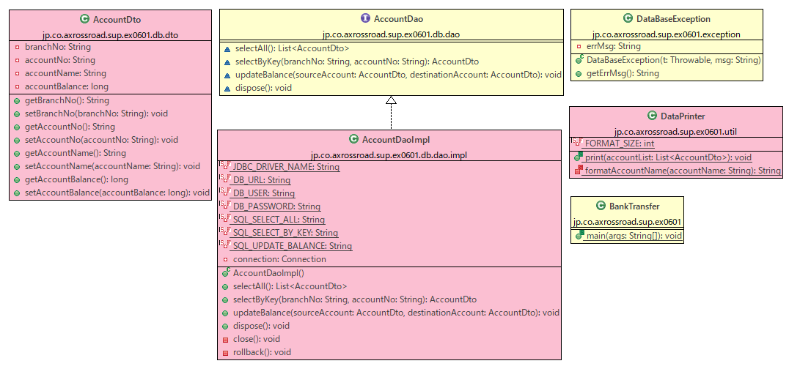
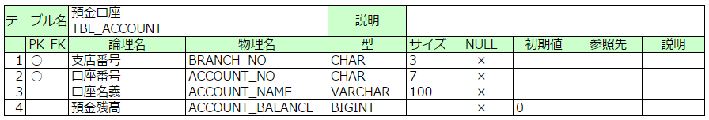

# Ex06_1

### 概要
データベース操作。

### 技術要素
* JDBC
* コレクション(List, Map)
* 文字列フォーマット操作

### リファレンス
* 『スッキリわかるJava入門 実践編 第2版』
  * P.71～P.110
  * P.329～P.370

### Git
* 作業ブランチ
  * develop/Ex06_1
* MergeRequestタイトル
  * Ex06_1

---

## 課題

預金口座の振込を行うプログラムのDBアクセスに関する部分(DAO)、データを格納する部分(DTO)と、文字列の形式操作に関する部分を作成しなさい。
なお、使用するクラスは以下のクラス図の通り。背景が赤のクラスを作成(適切なパッケージの配下に作成!)して、必要な処理を作成してください。

背景が黄色のクラスはすべて内部の実装まで用意されています。これらのクラスは内容を書き換えないでください。



### `jp.co.axrossroad.sup.ex0601.BankTransfer`(作成済)

mainメソッドが存在するので、このクラスがプログラムのエントリポイント、及び全体の処理のメインとなるフローが書かれている。
mainメソッドの処理の概要は以下の通り。

```
預金口座テーブルから全件のデータを取得し、振込前の状態として標準出力に出力する。
 ↓
(101) 1234567 の口座から(115) 7856342 の口座へ、500円を振り込む
 ↓
預金口座テーブルから全件のデータを取得し、振込後の状態として標準出力に出力する。
```

詰まるところ、500円の銀行振込を行う処理である。

#### 出力例

```
--- 振込前 ---
(037) 8765432 津島善子       300,000
(082) 4536271 松浦果南     2,000,000
(101) 1234567 渡辺曜         997,000
(115) 7856342 高海千歌         4,000
--- 振込後 ---
(037) 8765432 津島善子       300,000
(082) 4536271 松浦果南     2,000,000
(101) 1234567 渡辺曜         996,500
(115) 7856342 高海千歌         4,500
```

預金残高の表示を見ると、500円の振込が行われていることが確認できる。
プログラムの実行を行うたびに、500円の減算と加算が実行され、出力結果も変化していく。

### `jp.co.axrossroad.sup.ex0601.db.dao.impl.AccountDaoImpl`

`AccountDao`インタフェースを実装する形で作成する。各抽象メソッドの機能は、
`AccountDao`インタフェースのJavadocコメントを参考にすること。

DB接続情報(JDBCドライバ名、URL、ユーザ、パスワード)およびSQL文は、それぞれ文字列型の__クラス定数として定義__する。
定数名は上のクラス図の当該クラスのフィールドに記載がある。

コンストラクタで、DBへの接続を行い、privateフィールドの`connection`に接続オブジェクトを格納してください。
接続処理の中で例外が発生した場合は、`DataBaseException`のインスタンスを生成してスローすること。

SQL文にパラメータの部分が必要な場合は、SQLの文字列を文字列連結で作るのではなく、`PreparedStatement`を使うこと。
これは__SQLインジェクションを防止するため__である。

SQLの実行は処理は`try`ブロックに入れ、`try`ブロック内で発生した例外を捕捉した`catch`の中で`DataBaseException`のインスタンスを生成してスローすること。

`updateBalance`メソッドの中では、振込元口座、振込先口座の預金残高をそれぞれ更新する。
2つの更新処理は同一のトランザクションとするよう注意すること。

`Statement`、`PreparedStatement`、`ResultSet`のクローズは確実に行われるように注意して実装する。
try-with-resources構文を使う、finally句を使うなどの対策をとること。
特に複数のリソースのクローズを連続して行う場合に、
例外の発生などによって後からクローズする処理がスキップされないよう、細心の注意を払うこと。


### `jp.co.axrossroad.sup.ex0601.exception.DataBaseException`(作成済)

データベース操作に失敗した場合にスローする例外クラス。
スーパークラスが`Exception`のため、チェック例外となる。

`DataBaseException`のコンストラクタは引数が2つある。
第1引数は例外チェーン用に、直前で捕捉した例外オブジェクトを設定する。
第2引数は、妥当なエラーメッセージ文字列を設定する。


### `jp.co.axrossroad.sup.ex0601.db.dto.AccountDto`

預金口座テーブルの1レコード分の情報を格納するDTOである。

※DTO→フィールドとそのgetter/setterを持つ単純なクラス。
JavaBeansと構造はほぼ同じで、
用途がプロセスやネットワークの境界を越えてデータを交換するため。


### `jp.co.axrossroad.sup.ex0601.util.DataPrinter`

静的メソッド`print`で、上の出力例のように、標準出力に出力する。

口座名義の出力部分では、`formatAccountName`を使用してください。半角12文字分の左寄せで出力できます。

預金残高は3桁ごとのカンマ区切りで、カンマを除いた10桁右寄せで出力すること。


### データベース

データベースには、PostgreSQLを使用します。
[20.データベース環境の準備と使用](https://sites.google.com/a/axrossroad.co.jp/startupproject/home/new_progtraining/db_prepare)
に従って、自分のマシンにデータベース環境を用意します。データベース環境を用意した後は、テーブルの作成と初期データの挿入を行うこと(後述)。


### JDBCドライバ

Javaからデータベースに接続する際は、各データベース製品固有のJDBCドライバが必要です。
基本的には以下の手順でJDBCドライバの入手と設定を行ってから、プログラムの中で使用します。

1. JDBCドライバ(jarファイル)をダウンロード
2. ダウンロードしたJDBCドライバを適切な場所に配置
3. JDBCドライバへのクラスパス設定を行う

ですが、以上の手順は
[ビルド](https://ja.wikipedia.org/wiki/%E3%83%93%E3%83%AB%E3%83%89_(%E3%82%BD%E3%83%95%E3%83%88%E3%82%A6%E3%82%A7%E3%82%A2))
システムの一種である
[Gradle](https://ja.wikipedia.org/wiki/Gradle)
のビルドスクリプト(build.gradle)によって自動化しているので、今回は特別に何かする必要はなく、すぐにプログラムを書き始めることができるようになっています。

※Ex06_1内の「プロジェクトと外部の依存関係」の中に「postgresql-42.1.4.jar」が入っていることで確認できます。

### テーブル定義と初期データ

今回使用するテーブルは、以下の1つのみ。



sqlディレクトリの中の__Ex06_1.ddl__がテーブル生成用のSQLなので、A5:SQL Mk-2などのデータベース操作ツールを使用して、これを実行する。また初期データは__insert.sql__で投入できるので、テーブル生成後にあわせて実行すること。